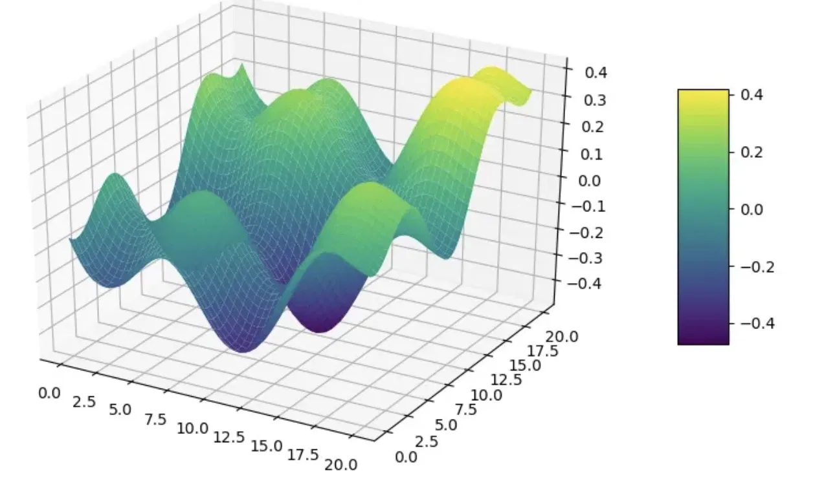

# Black-Box Optimisation (BBO) Capstone Project

A sequential, model-guided approach to optimising eight unknown functions using Gaussian Process surrogates, acquisition functions, and neural network gradient guidance.

---

## Non-Technical Explanation

Imagine trying to find the highest point on a hilly landscape while blindfolded — you can only feel the ground beneath your feet at each step. This project tackles exactly that challenge, known as black-box optimisation. Eight hidden mathematical functions were provided, and the goal was to find the input values that produce the highest possible output without ever seeing the functions themselves. Over 13 weeks, a machine learning model learned the shape of each function from submitted data points and used that knowledge to make progressively smarter guesses. The project demonstrates how AI can make efficient decisions under uncertainty — a skill directly applicable to drug discovery, engineering design, and automated machine learning.

---

## Data

The dataset consists of query-response pairs generated by submitting input coordinates to the BBO capstone portal. Each query point is a vector of continuous values in [0, 1] formatted to six decimal places, and the portal returns a scalar output. There are eight unknown functions ranging from 2D to 8D. A total of 104 observations were collected across 13 rounds.

Full dataset metadata is documented in [data_sheet.md](data_sheet.md).

---

## Model

The primary surrogate model is a Gaussian Process Regressor from scikit-learn, fitted to the growing set of observed query-response pairs after each round. A GP was chosen because it provides both predictions and calibrated uncertainty estimates — critical for sequential optimisation under uncertainty. The uncertainty estimates feed into an Expected Improvement acquisition function that selects the next query point. From Round 4 onward, a PyTorch neural network surrogate was introduced for gradient-informed query selection in higher-dimensional functions.

Full model documentation in [model_card.md](model_card.md).

---

## Hyperparameter Optimisation

The GP uses an RBF kernel combined with a WhiteKernel to account for noise. Both the length scale and noise level are optimised automatically at each fitting step by maximising the log marginal likelihood, using n_restarts_optimizer=5. The EI threshold xi is set per function: 0.005 for well-characterised lower-dimensional functions and 0.05 for higher-dimensional functions requiring more exploration.

---

## Results

| Function | Dimensions | Best y Round 1 | Best y Round 7 | Best y Round 13 |
|----------|-----------|---------------|---------------|----------------|
| F1 | 2D | - | - | - |
| F2 | 2D | - | - | - |
| F3 | 3D | - | - | - |
| F4 | 4D | - | - | - |
| F5 | 4D | - | - | - |
| F6 | 5D | - | - | - |
| F7 | 6D | - | - | - |
| F8 | 8D | - | - | - |

---

## Supporting Documentation

- [Data Sheet](data_sheet.md)
- [Model Card](model_card.md)

---

## References

- Brochu, Cora and de Freitas (2010). A Tutorial on Bayesian Optimization of Expensive Cost Functions
- Snoek, Larochelle and Adams (2012). Practical Bayesian Optimization of Machine Learning Algorithms
- Rasmussen and Williams (2006). Gaussian Processes for Machine Learning
- Frazier (2018). A Tutorial on Bayesian Optimization
- Mitchell et al. (2019). Model Cards for Model Reporting
- Gebru et al. (2021). Datasheets for Datasets
